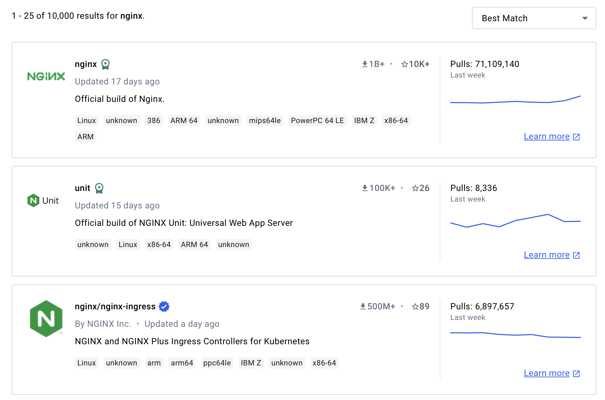

- Open https://hub.docker.com in another tab or browser

- Search for Nginx
- Click on the official image (Should be on top)

---
**Talk in class about**

- Official Image
- Reference
- Tags
- Image veriant
- OS/Arch
- Use of the image (Examples)

---
