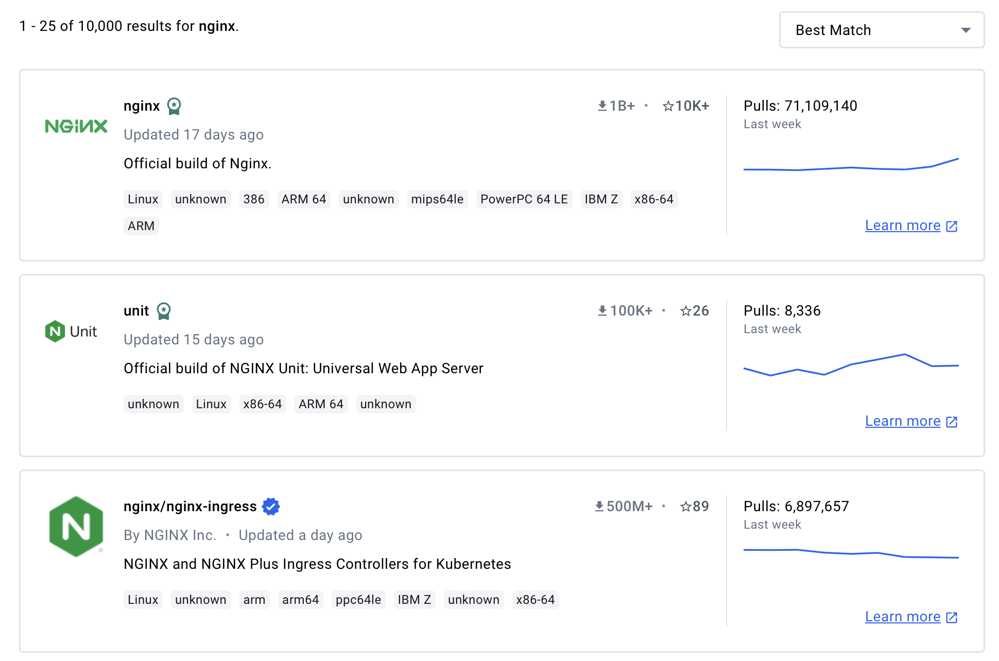

- Open https://hub.docker.com in another tab or browser

- Search for Nginx
- Click on the official image (Should be on top)

- Go thru the documentaion in class, and talk about:
    - Official Image
    - Reference
    - Tags
    - Image veriant
    - OS/Arch
    - Use of the image (Examples)