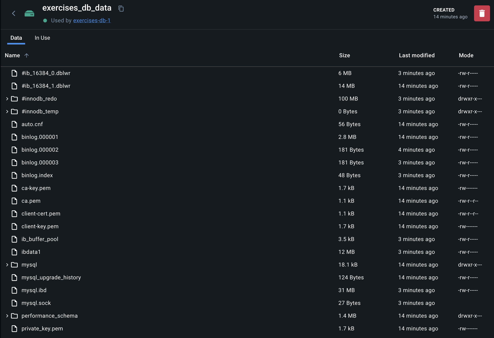

To examine the content of a one of the volumes from the previus steps run
```execute
docker volume inspect exercises_db_data
```
The output should be
```
[
    {
        "CreatedAt": "2024-05-07T12:58:17Z",
        "Driver": "local",
        "Labels": {
            "com.docker.compose.project": "exercises",
            "com.docker.compose.version": "2.24.7",
            "com.docker.compose.volume": "db_data"
        },
        "Mountpoint": "/var/lib/docker/volumes/exercises_db_data/_data",
        "Name": "exercises_db_data",
        "Options": null,
        "Scope": "local"
    }
]
```

In a normal enviroment you would be able to run 
```
ls /var/lib/docker/volumes/exercises_db_data/_data
```
To see the content of the volume.
But since you are running in a restricted enviroment, it's not possible here.

I have taken a screenshoot from Docker desktop, to show the content of the volume, after running it quickly and stopping it again.


